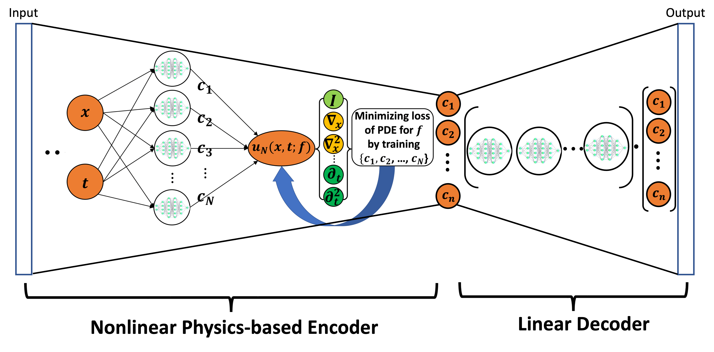

## Abstract 
We propose a novel data-lean operator learning algorithm, the Reduced Basis Neural Operator (ReBaNO), to solve a group of PDEs with multiple distinct inputs. Inspired by the Reduced Basis Method and the recently introduced Generative Pre-Trained Physics-Informed Neural Networks, ReBaNO relies on a mathematically rigorous greedy algorithm to build its network structure offline adaptively from the ground up. Knowledge distillation via task-specific activation function allows ReBaNO to have a compact architecture requiring minimal computational cost online while embedding physics. In comparison to state-of-the-art operator learning algorithms such as PCA-Net, DeepONet, FNO, and CNO, numerical results demonstrate that ReBaNO significantly outperforms them in terms of eliminating/shrinking the generalization gap for both in- and out-of-distribution tests and being the only operator learning algorithm achieving strict discretization invariance.

## Key Features

- **Data-lean approach**: Requires no high-fidelity solutions
- **Nonlinear encoder-linear decoder design**: The input is encoded via a nonlinear physics-driven optimization problem and decoded by combining with reduced basis functions
- **Discretization invariance**: Maintain strict discretization invariance across different grids
- **Offline-online decomposition**: The reduced basis functions are selected offline via a greedy algorithm and the solutions for new inputs are given through a light-weighted fine tuning process
- **Physics embedding**: Incorporates physical laws directly both on the offline and online stages

## Publications

### Preprints
- Zheng, H. et al. (2025) "ReBaNO: Reduced Basis Neural Operator Mitigating Generalization Gaps and Achieving Discretization Invariance." arXiv. Available at: https://doi.org/10.48550/arXiv.2509.09611.

## Code and Resources

- [GitHub Repository](https://github.com/haolanzheng/rebano)
- [arXiv Paper](https://doi.org/10.48550/arXiv.2509.09611)
